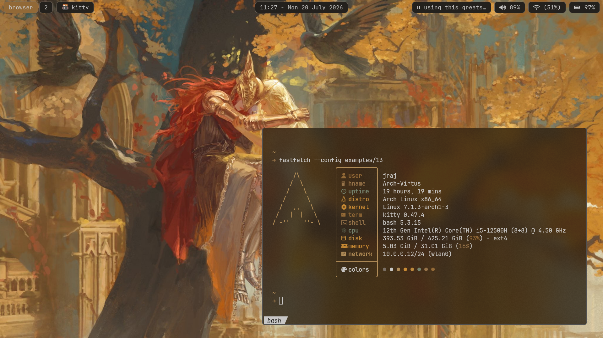

# Dotfiles
----

This is the config folder for my linux machine for window manager and more tools:
- niri
- waybar
- alacritty
- kitty
- fastfetch
- bashrc
- zsh config
- htop
- ranger
- swaync
- tmux
    ```bash
    Ctrl+S #modifier
    ```

```bash
git clone https://github.com/rajeshjaga/dotfiles ~/dotfiles/
cd ~/dotfiles
git checkout master
stow . --ignore=README.md # dont use adopt just delete the conflict files
```

Make sure to install below apps (maybe I'll write a script to install required pieces of software)
```bash
sudo pacman -S  ranger nwg-look brillo ttf-fira-code ttf-roboto noto-fonts noto-fonts-emoji noto-fonts-extra rofi terminus-font kitty alacritty imagemagick feh imv wget curl jq stow luajit luarocks cmake ninja meson papirus-icon-theme python-pillow w3m zathura zathura-pdf-poppler thunar xdg-user-dirs niri swaybg swayidle waybar  chromium lua-lgi neovim tmux fd ripgrep man man-db starship zsh yt-dlp pavucontrol mpd mpc mpv rmpc vlc obs-studio  btop htop inet-utils netstat bind qbittorrent sddm sddm-kcm
```


### To add services such as swayidle, swaybg, waybar, mako
```bash
systemctl --user add-wants niri.service swaybg.service #background iamge setter
systemctl --user add-wants niri.service swayidle.service #idle timer does notice gamepad, bummer
systemctl --user add-wants niri.service waybar.service #bar
systemctl --user add-wants niri.service mako.service #notifications
```
